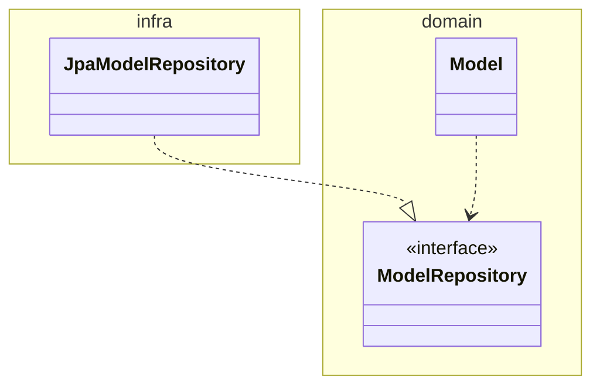
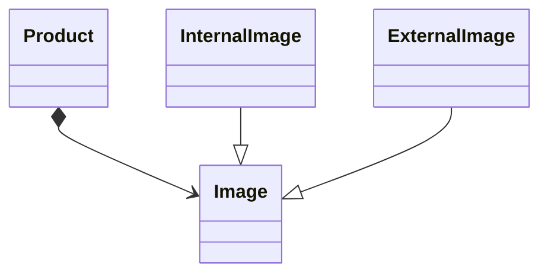
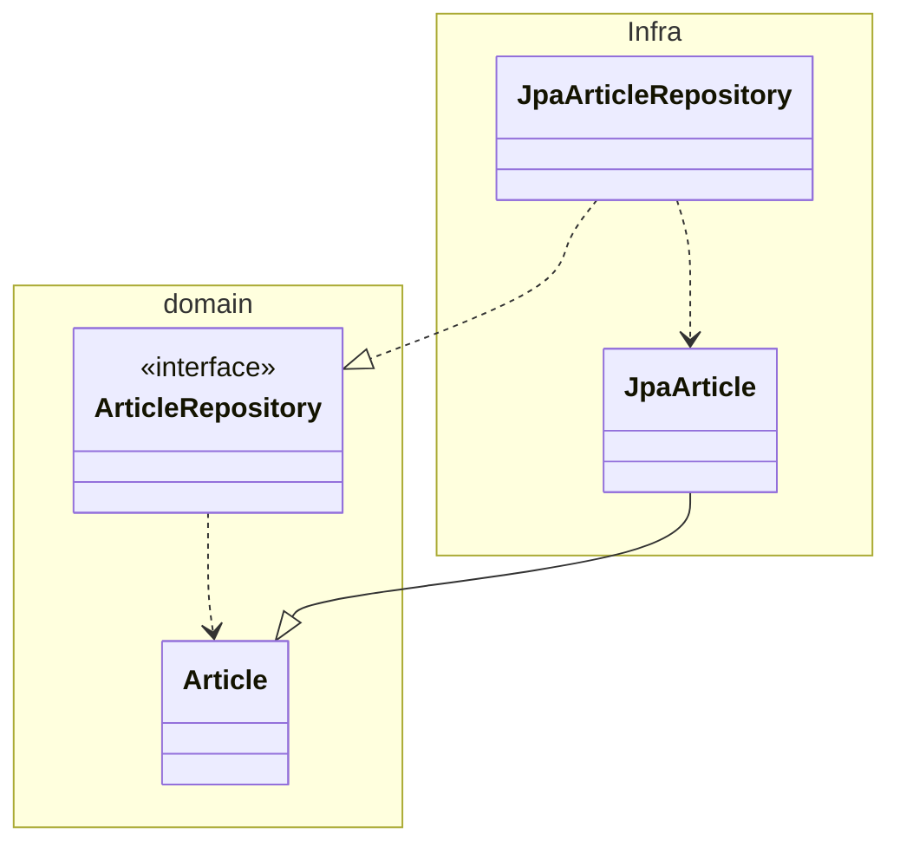

# 4장 리포지터리와 모델 구현

## 4.1 JPA를 이용한 리포지터리 구현

### 4.1.1 모듈 위치

* 리포지토리 인터페이스는 애그리거트와 같이 도메인 영역에 속하며 리포지토리를 구현하는 클래스는 인프라스터럭처 영역에 속합니다.



* 팀 표준에 따라 리포지토리 구현 클래스를 domain.impl과 같은 패키지에 위치시킬 수도 있지만 이것은 리포지토리 인터페이스와 구현체를 분리하기 위한 타협안이지 좋은 설계는 아닙니다.
* 가능하면 리포지토리 구현 클래스를 인프라스트럭처 영역에 위치시켜서 인프라스트럭처에 대한 의존을 낮춰야 합니다.

### 4.1.2 리포지토리 기본 기능 구현

* 리포지토리가 제공하는 기본 기능은 다음과 같습니다.
  * ID로 에그리거트 조회하기
  * 애그리거트 저장하기

## 4.3 매핑 구현

### 4.3.1 엔티티와 밸류 기본 매핑 구현

* 애그리거트와 JPA 매핑을 위한 기본 규칙은 다음과 같습니다.
  * 애그리거트 루트는 엔티티이므로 @Entity로 매핑 설정한다.
* 한 테이블에 엔티티와 밸류 데이터가 같이 있다면
  * 밸류는 @Embeddable로 매칭 설정한다.
  * 밸류 타입 프로퍼티는 @Embedded로 매핑 설정한다.

### 4.3.2 기본 생성자

* JPA를 사용하기 위해서는 기본 생성자를 만들어줘야 합니다.
* 기본 생성자를 만들 때, 다른 코드에서 기본 생성자를 호출하지 못하도록 protected로 선언해야 합니다.

### 4.3.3 필드 접근 방식 사용

* JPA는 필드와 메소드의 두 가지 방식으로 매핑을 진행할 수 있습니다.
* 메소드 방식을 사용하기 위해서는 get/set 메소드를 구현해야 합니다.

```Java
@Entity
@Access(AccessType.PROPERTY)
public class Order {
  
  ...
}
```

* 엔티티에 프로퍼티를 위한 공개 get/set 메소드가 존재한다면 도메인의 의도가 사라지고 객체가 아닌 데이터 기반으로 엔티티를 구현할 가능성이 높아집니다.
특히 set 매소드는 캡슐화를 깨는 원인이 될 수 있기에 조심해서 사용해야 합니다.
* 객체가 제공하는 기능 중심으로 엔티티를 구현하게끔 유도하기 위해서는 JPA 매핑 처리를 프로퍼티 방식이 아닌 필드 방식으로 선택해서 불필요한 get/set 메소드를 구현하면 안됩니다.

### 4.3.4 AttributeConverter를 이용한 밸류 매핑 처리

* 밸류 타입의 프로퍼티를 한 개 컬럼에 매핑을 해야할 떄도 있습니다. 이때 AttributeConverter를 이용해서 밸류 타입과 칼럼 데이터 간의 변환을 처리할 수 있습니다.

```Java
@Converter(autoApply=true)
public class MoneyConverter implements AttributeConverter<Money, Integer> {
  @Override
  public Integer converterToDatabaseColumn(Money money){
    return money == null ? null : money.getValue();
  }
  
  ...
}
```

* AttributeConverter 구현하는 과정에서 @Converter 애노테이션을 통해 모든 Money 타입의 프로퍼티에 대해 MoneyConverter를 자동으로 적용할 수 있습니다.

### 4.3.5 밸류 컬렉션 : 별도 테이블 매핑

* 엔티티 내부에 List와 같은 컬렉션을 프로퍼티로 지정할 수 있습니다.
* 밸류 컬렉션을 별도 테이블로 매핑할 떄는 @ElementCollection과 @CollectionTable을 함께 사용합니다.
* JPA는 @OrderColumn을 이용해서 지정한 칼럼에 리스트의 인덱스 값을 저장할 수 있습니다.
* @CollectionTable은 밸류를 저장할 테이블을 지정합니다.

### 4.3.6 밸류 컬렉션 : 한 개 칼럼 매핑

* 밸류 컬렉션을 별도 테이블이 아닌 한 개 칼럼에 저장해야 할 때가 있습니다. 이때도 AttributeConverter를 이용하여 구현할 수 있습니다.

### 4.3.7 밸류를 이용한 ID 매핑

* 식별자라는 의미를 부각시키기 위해 식별자 자체를 밸류 타입으로 만들 수도 있습니다. 예로는 OrderNo, MemberId 밸류 타입이 있습니다.
* 밸류 타입을 식별자로 매핑하면 @Id 대신 @EmbeddedId를 사용해야 합니다.

```Java
@Entity
public class Order{
  @EmbeddedId
  private OrderNo number;
  ...
}

@Embeddable
public class OrderNo implements Serializable{
  @Column(name="order_number")
  private String number;
  ...
}
```

* JPA에서 식별자 타입은 Serializable 타입이여하므로 식별자로 사용할 밸류 타입은 Serializable 인터페이스를 상속받아야 합니다.
* 밸류 타입으로 식별자를 구현할 때 얻을 수 있는 장점은 식별자에 기능을 추가할 수 있다는 점입니다.

### 4.3.8 별도 테이블에 저장하는 밸류 매핑

* 애그리거트에서 루트 엔티티를 뺀 나머지 구성요소는 대부분 밸류입니다.
* 루트 엔티티 외에 또 다른 엔티티가 있다면 진짜 엔티티인지 의심해 봐야 합니다. 하지만 별도 테이블에 데이터를 저장한다고 해서 엔티티인 것은 아닙니다.
* 밸류가 아닌 엔티티가 확실하다면 해당 엔티티가 다른 애그리거트는 아닌지 확인해야 합니다.
* 자신만의 독자적인 라이프 사이클을 가진다면 구분되는 애그리거트일 가능성이 높습니다.
* 애그리거트에 속한 객체가 밸류인지 엔티티인지 구분하는 방법은 고유 식별자를 갖는지 확인하는 것입니다. 
하지만 식별자를 찾을 때 매핑되는 테이블의 식별자를 애그리거트 구성요소의 식별자와 동일한 것으로 착각하면 안 됩니다.
* 만약 조회에 있어 불필요한 조인으로인해 각 테이블은 매핑 방식으로 변경하여 지연 로딩 방식으로 설정할 수 있습니다. 하지만 이는 밸류인 모델을 엔티티로 만드는 것이므로 좋은 방법은 아닙니다.

### 4.3.9 밸류 컬렉션을 @Entity로 매핑하기

* 개념적으로 밸류인데 구현 기술의 한계나 팀 표준 때문에 @Entity를 사용해야 할 떄도 있습니다.
* 상속 구조를 사용할때가 그 예입니다.

제품의 이미지 업로드 방식에 따라 이미지 경로와 섬네일 이미지 제공 여부가 달리진다고 생각해보자. 이를 계층구조로 가져가면 다음과 같다.




JPA에서는 @Embeddable 타입의 클래스 상속 매핑을 지원하지 않아 Inheritance를 사용하여 구현해야한다.

하지만 이러한 방식을 사용하면 Product에서 @OneToMany를 통해 Image를 가지며, 해당 이미지들을 제거할 때, Hibernate의 방식에 따라 모든 데이터를 조회하고 Delete를 진행한다.
이는 성능 문제가 발생할 수 있다.

만약 @Embeddable 타입을 통해 관리한다면 Hibernate에서 필드 값을 로딩하지 않고 바로 delete 쿼리로 삭제 처리를 할 수 있다.


### 4.3.10 ID 참조와 조인 테이블을 이용한 단방향 M-N 매핑

* 요구사항을 구현하는데 있어 집합 연관을 사용하는 것이 유리하다면 ID 참조를 이용한 단방향 집합 연관을 적용해볼 수 있습니다.

```Java
@Entity
public class Product{
  @EmbeddedId
  private ProductId id;
  
  @ElementCollection
  @CollectionTable(name="product_category",
              joinColumns = @JoinColumn(name="product_id"))
  private Set<CategoryId> categoryIds;
```


## 4.4 애그리거트 로딩 전략

* JPA 매핑을 설정할 때 항상 기억해야 할 점은 애그리거트에 속한 객체가 모두 모여야 완전한 하나가 된다는 것입니다.
* 조회 시점에 애그리거트를 완전한 상태가 되도록 하려면 애그리거트 루트에서 연관 매핑의 조회 방식을 EAGER로 설정하면 됩니다.
* EAGER 방식을 사용한다면 오히려 문제가 발생할 수 있습니다.
  * EAGER 방식을 통한 조회는 JPA에서 쿼리를 생성할 때, 카타시안 조인을 사용하며 이는 쿼리 결과에 중복을 발생시킬 수 있습니다.
* 애그리거트는 개념적으로 하나여야 합니다. 하지만 루트 엔티티를 로딩하는 시점에 애그리거트에 속한 객체를 모두 로딩해야 하는것은 아닙니다.
* 애그리거트가 완전해야 하는 이유는 다음과 같습니다.
  * 상태를 변경하는 기능을 실행할 때 애그리거트 상태가 완전해야 하기 때문입니다.
  * 표현 영역에서 애그리거트의 상태 정보를 보여줄 때 필요합니다.
* 상태 변경 기능을 실행하기 위해 조회 시점에 즉시 로딩을 이용해서 애그리거트를 완전한 상태로 로딩할 필요는 없습니다.
* 일반적으로 애플리에키션은 수정보다 조회가 많기 때문에 지연 로딩으로 인한 성능 저하는 보통 문제가 되지 않습니다.
* 즉시 로딩이나 지연 로딩은 애그리거트에 맞게 선택해야 합니다.

## 4.5 애그리거트의 영속성 전파

* 애그리거트가 완전한 상태여야 한다는 것은 애그리거트 루트를 조회할 때뿐만 아니라 저장하고 삭제할 때도 하나로 처리해야 함을 의미합니다.
  * 저장 메소드는 애그리거트 루트만 저장하면 안 되고 애그리거트에 속한 모든 객체를 저장해야 합니다.
  * 삭제 메소드는 애그리거트 루트뿐만 아니라 애그리거트에 속한 모든 객체를 삭제해야 합니다.

## 4.6 식별자 새성 기능

* 식별자는 크게 세 가지 방식 중 하나로 생성합니다.
  * 사용자가 직접 생성
  * 도메인 로직으로 생성
  * DB를 이용한 일련번호 사용
* 식별자 생성 규칙이 있다면 별도 서비스로 식별자를 생성해야 합니다.

```Java
public class ProductIdService{
  public ProductId nextId(){
    ...
  }
}
```

* DB 자동 증가 칼럼을 식별자로 사용하면 식별자 매핑에서 @GeneratedValue를 사용합니다.
* 자동 증가 칼럼은 데이터가 저장된 후 식별자가 생성되기에 도메인 객체가 저장된 후에 식별자를 구할 수 있습니다.

## 4.7 도메인 구현과 DIP

* DIP에 따르면 @Entity, @Table은 구현 기술에 속하지만 예에서의 Article은 도메인 모델임에도 JPA, 즉 구현 기술에 의존하고 있습니다.
* 리포지토리 또한 JPA에서 제공하는 인터페이스를 상속하고 있기에 구현 기술에 의존적입니다.
* 구현기술에 의존적이지 않게 모델과 리포지토리는 순수 자바 코드로만 구성되며, JPA 관련 클래스는 인프라스트럭처에 위치해야 합니다.



* 위 구조를 가지게 된다면 구현 기술을 변경하더라도 도메인이 받는 영향을 최소화할 수 있습니다.
* DIP를 완벽하게 지키면 좋겠지만, 개발 편의성과 실용성을 가지면서 구조적인 유연함은 어느 정도 유지하면 좋습니다.
* 복잡도를 높이지 않으면서 기술에 따른 구현제약이 낮으면 합리적인 선택이라고 생각합니다.
