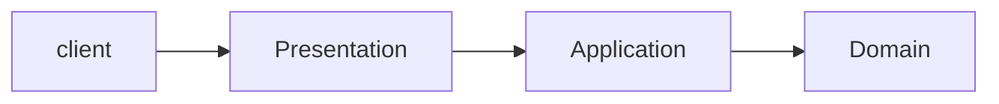

# 6장 응용 서비스와 표현 영역

## 6.1 표현 영역과 응용 영역

* 표현 영역은 사용자의 요청을 해석합니다.
* 응용 영역은 사용자가 원하는 기능을 제공합니다.

## 6.2 응용 서비스의 역할

* 응용 서비스는 사용자가 요청한 기능을 실행한다.
* 응용 서비스는 사용자의 요청을 처리하기 위해 리포지토리에서 도메인 객체를 가져와 사용한다.
* 응용 서비스가 복잡하면 응용 서비스에서 도메인 로직의 일부를 구현하고 있을 수 있지만, 이는 코드 중복, 로직 분산등 
코드 품질에 안 좋은 영향을 줄 수 있다.
* 응용 서비스는 트랜잭션 처리도 담당한다.

### 6.2.1 도메인 로직 넣지 않기

* 도메인 로직을 도메인 영역과 응용 서비스에 분산해서 구현하면 응집도가 떨어지며, 중복 코드가 발생할 가능성이 높아진다.

## 6.3 응용 서비스의 구현

* 응용 서비는 포현 영역과 도메인 영역을 연결하는 매개체 역할을 하며 이는 퍼사드와 같은 역할을 한다.

### 6.3.1 응용 서비스의 크기

* 응용 서비스를 구현하면서 하나의 클래스에서 모든 기능을 구현하거나, 각 기능을 가지는 클래스로 나누어 구현하는 방식이 있다.
* 하나의 클래스에서 모든 기능을 구현하면 로직의 중복을 줄일 수 있는 장점이 있다. 하지만 이는 클래스의 크기가 커짐을 의미한다.
* 기능별로 클래스를 만든다면 2~3개의 메소드를 가지는 클래스를 만들게 된다. 해당 방식은 코드 품질을 일정 수준으로 유지하는 데 도움이 된다.

### 6.3.2 응용 서비스의 인터페이스와 클래스

* 인터페이스를 정의하는 경우는 구현 클래스가 여러개 존재하여 런타임에 교체해야 하는 경우이다.
* 인터페이스 정의는 구현에 필요한 소스 코드가 많아지고 구현 클래스에 대한 간접 참조가 증가해 복잡도가 증가한다.

### 6.3.3 메소드 파라미터와 값 리턴

* 응용 서비스에서 애그리거트 자체를 리턴한다면 표현 영역에서도 도메인 로직을 실행시킬 수 있기 때문에 응집도를 낮추는 원인이 될 수 있다.
즉, 필요한 데이터만 반환하는게 좋다.

### 6.3.4 표현 영역에 의존하지 않기

* 응용 서비스의 파라미터 타입을 결정할 때 포현 영역과 관련된 타입을 사용하면 안된다.
* 응용 서비스에서 표현 영역에 대한 의존이 발생하면 응용 서비스만 단독으로 테스트하기 어려워진다.

### 6.3.5 트랜잭션 처리

## 6.4 표현 영역

* 표현 영역의 책임은 크게 다음과 같다.
  * 사용자가 시스템을 사용할 수 있는 흐름을 제공하고 제어한다.
  * 사용자의 요청을 알맞은 서비스에 전달하고 결과를 사용자에게 제공한다.
  * 사용자의 세션을 관리한다.

## 6.5 값 검증

* 값 검증은 표현 영역과 응용 서비스 두 곳에서 모두 수행할 수 있다. 원칙적으로는 모든 값에 대한 검증은 응용 서비스에서 처리한다.
* 스프링에서는 validator를 제공함으로써 값 검증을 쉽게 할 수 있다.
* 표현 영역은 필수 값과 값의 형식을 검사하면 실질적으로 응용 서비스는 논리적 오류만 검사한다.

## 6.6 권한 검사

* 인증과 권한에 대한 검사는 표현 영역, 응용 서비스, 도메인에서 모두 구현할 수 있다. 이를 스프링에서는 필터를 통해 구현할 수 있다.

## 6.7 조회 전용 기능과 응용 서비스

* 서비스에서 수행하는 로직이 오직 단일 쿼리 조회만 있다면 서비스 없이 컨트롤러에서 바로 조회하는 것도 좋다.