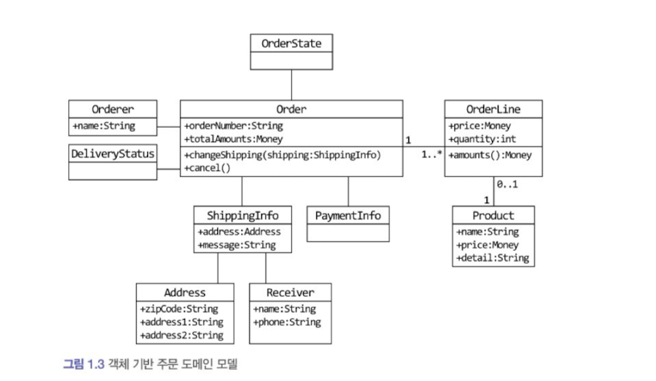
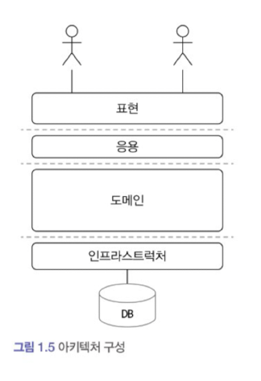
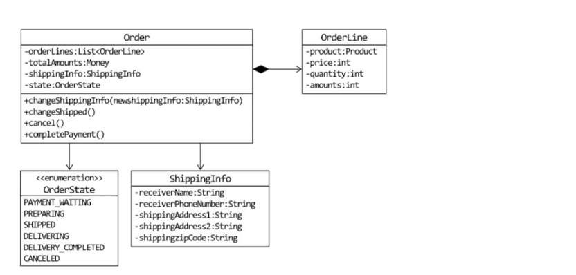

# 도메인 주도 개발 시작하기 챕터1 도메인 모델 시작하기

## 도메인이란?

우리는 책을 구매할 때 직접 서점을 가기도 하지만, 온라인 서점을 자주 이용하곤 한다.

우리가 사용하는 온라인 서점은 장바구니도 있고, 쿠폰 유무를 확인할 수 있고, 구매하고 배송 추적을 하기도 한다.

이것을 개발자 관점에서 바라보면 온라인 서점은 구현해야 할 소프트웨어의 대상이 된다.

이 소프트웨어는 상품 조회, 구매, 결제, 배송 추적 등의 기능을 제공해야 하는 것이다.

이때 온라인 서점은 소프트웨어로 해결하고자 하는 문제 영역, 즉 도메인에 해당한다.

그리고 한 도메인은 하위 도메인으로 나눌 수 있다.

## 도메인 전문가와 개발자 간 지식 공유

온라인 홍보, 정산, 배송 등 각 영역에는 전문가가 있고, 이들 전문가는 해당 도메인에 대한 지식과 경험을 바탕으로 본인들이 원하는 기능을 개발하길 요구한다.

개발자는 이런 요구사항을 분석하고 설계하여 코드를 작성해야 하는데, 이때 요구사항은 첫 단추와 같다.

이때 단추를 잘못 끼우게 되면 코드는 수정하기 매우 번거롭다.

따라서 요구사항을 올바르게 이해해야 하는데, 비교적 간단한 방법은 개발자와 전문가가 직접 대화하는 것이다.

## 도메인 모델

도메인 모델에는 다양한 정의가 존재하는데, 기본적으로 도메인 모델은 특정 도메인을 개념적으로 표현한 것이다.

예를 들어 온라인 서점을 생각해보자.

상품을 선택하고, 배송지를 입력한다. 그리고 상품 가격을 통해 지불 금액을 계산하고, 금액 지불을 위한 결제 수단을 선택한다. 주문한 뒤에도 배송 전이면 배송지 주소를 변경하거나 주문을 취소할 수 있을 것이다.

이러한 주문 모델을 객체 모델로 구성하면 다음과 같을 것이다.



물론, 상태 다이어그램과 같은 방식을 통해서도, 그래프를 통해서도 여러가지 방법을 통해서 도메인 모델을 표현할 수 있다.

중요한 것은 도메인 도메인 모델을 이해하는데 도움을 주는 것이다.

도메인 모델은 기본적으로 도메인 자체를 이해하기 위한 개념 모델로, 개념 모델을 이용해서 바로 코드를 작성할 수 있는 것은 아니기에 구현 기술에 맞는 구현 모델이 따로 필요하다.

## 도메인 모델 패턴

일반적인 어플리케이션의 아키텍처는 다음과 같이 네개의 영역으로 구성된다.



이때 응용은 사용자가 요청한 기능을 실행하는 것으로, 업무 로직을 직접 구현하지 않고 도메인 계층을 조합해서 기능을 수행한다.

도메인의 경우는 시스템이 제공할 도메인 규칙을 구현하는 것이다.

그 외에 인프라스트럭처는 외부 시스템과 연동을 처리하고 표현은 사용자에게 정보를 보여주는 역할을 한다.

지금부터 이 책에서 사용할 도메인 모델은 모데인 모델 패턴을 의미한다.

도메인 모델은 아키텍처 상의 도메인 계층을 객체 지향 기법으로 구현하는 패턴을 말한다.

도메인 계층은 도메인의 핵심 규칙을 구현한다.

이제 예시를 들어보자.

우리에게 `Order` 라는 클래스와 `OrderState` 라는 enum클래스가 존재한다고 가정하자.

이때 `OrderState` 는 `Order` 에 속한 데이터로 이제 아래와 같이 `Order` 클래스 내부에서 배송지 정보 변경 가능 여부를 판단할 수 있다.

```java
public class Order {
	private OrderState state;
	private ShippingInfo shippingInfo;
	
	public void changeShippingInfo(ShippingInfo newShippingInfo) {
		if (!isShippingChangeInfo) {
			throw new ...
		}
		this.shppingInfo = newShippingInfo
	}
	
	private boolean isShippingChangeInfo() {
		return state == OrderState.PAYMENT_WAITING || 
			state == OrderState.PREPARING;	
	}
	...
}
```

이때 중요한 것은 배송지 변경 가능 여부를 판단하는 기능이 `Order` 에 있던, `OrderState` 에 있던 주문과 관련된 중요 업무 규칙을 주문 도메인 모델에서 구현한다는 점이다.

## 도메인 모델 추출

우선 도메인에 대한 이해 없이 코딩을 시작할 수 없다.

따라서 무엇을 사용하던, 구현을 시작하려면 도메인에 대한 초기 모델이 필요하다.

도메인을 모델링할 때 기본이 되는 작업은 모델을 구성하는 핵심 구성요소, 규칙, 기능을 찾는 것이다.

그리고 이 과정은 요구사항에서 출발한다.

위의 주문 도메인과 관련된 몇가지 요구사항을 살펴보자.

- 최소 한 종류의 상품을 주문해야 한다.
- 한 상품을 한개 이상 주문할 수 있다.
- 총 주문 금액은 각 상품의 구매 가격의 합이다.
- 각 상품의 구매 가격 합은 상품 가격에 구매 개수를 곱한 값이다.
- 주문할 때 배송지 정보를 반드시 기입해야 한다.
- 배송지 정보는 받는 사람 이름, 전화번호, 주소로 구성된다.
- 출고를 하면 배송지를 변경할 수 없다.
- 출고 전에 주문을 취소할 수 있다.
- 고객이 결제를 완료하기 전에는 상품을 준비하지 않는다.

이때 우리는 주문이 ‘출고 상태로 변경하기’, ‘배송지 정보 변경하기’, ‘주문 취소하기’, ‘결제 완료하기’ 기능을 제공한다는 것을 알 수 있다.

```java
public class Order {
	public void changeShipped() {...};
	public void changeShippingInfo(ShippingInfo newShipping) {...};
	public void cancel() {...};
	public void competePayment() {...};
}
```

그리고 다음 요구사항은 주문 항목이 어떤 데이터로 구성되는지 알려준다.

- 한 상품을 한 개 이상 주문할 수 있다.
- 각 상품의 구매 가격 합은 상품 가격에 구매 개수를 곱한 값이다.

두 요구사항에 따르면 주문 항목을 표현하는 `OrderLine` 은 적어도 주문할 상품, 가격, 개수를 포함해야 하며 추가로 각 구매 항목의 구매 가격도 제공해야 한다.

```java
public class OrderLine {
	private Product product;
	private int price;
	private int quantity;
	private int amounts;
	
	public OrderLine(Product product, int price, int quantity) {
		...
		this.amounts = calculateAmounts();
	}
		
	private int calculateAmounts() {
		return price * quantitity;
	}
	
	public int getAmounts() {
		...
	}
	...
}
```

이와 같이 `OrderLine`은 한 상품을 얼마에 몇개 살지 담고 있으며 가격을 구하는 로직을 구현하고 있다.

그리고 다음 요구사항은 `Order`과 `OrderLine`의 관계를 알려준다.

- 최소 한 종류 이상의 상품을 주문해야 한다.
- 총 주문 금액은 각 상품의 구매 가격 합을 모두 더한 금액이다.

그렇다면 `Order` 는 `OrderLine` 을 최소 한개 가지고 있어야 할 것이며, 총 주문 금액은 `OrderLine` 들을 통해 구할 수 있을 것이다.

따라서 `Order` 클래스에 `List<OrderLine>` 을 추가하고 이에 대한 유효성 검사과 총 금액을 계산하는 로직을 추가할 수 있다.

그리고 이어서 배송지 정보는 이름, 전화번호, 주소 데이터를 가지므로 `ShippingInfo` 클래스를 다음과 같이 만들 수 있다.

```java
public class ShppingInfo {
	private String receiveName;
	private String receivePhoneNumber;
	private String shippingAddress1;
	private String shippingAddress2;
	private String shppingZipcode;
	
	...
}
```

그리고 요구사항을 더 살펴보면 `Order` 에는 `OrderLine` 의 리스트 뿐만 아닌 `ShippingInfo` 또한 포함해야 한다는 것을 알 수 있다.

따라서 `Order` 의 필드에 `ShippingInfo` 를 추가할 수 있을 것이다.

그러면 요구사항에 따라 이에 대한 제한 조건 또한 추가할 수 있다.

## 엔티티와 밸류

도출한 모델은 크게 엔티티Entity와 밸류Value로 구분할 수 있다.



이것은 요구사항 분석 과정에서 만든 모델로 위 그림에는 엔티티도 존재하고 밸류도 존재한다.

### 엔티티

엔티티의 가장 큰 특징은 식별자를 가지는 것이다.

예를 들면 `Order` 의 경우는 주문으로 엔티티이고, 각각의 주문이 가지는 orderId가 식별자가 될 것이다.

엔티티의 식별자는 변하지 않는다.

엔티티를 구현한 클래스는 식별자를 이용하여 `equal()` 와 `hashCode()` 를 구현할 수 있다.

### 엔티티의 식별자 생성

다음과 같은 방식으로 식별자를 생성할 수 있다.

- 특정 규칙에 따라 생성
- UUID와 같은 고유 식별자 생성기 사용
- 값을 직접 입력
- 일련 번호 사용 (시퀀스나 DB의 자동 증가 컬럼 사용)

### 밸류 타입

ShippingInfo 는 받는 사람과 주소에 대한 데이터를 가지고 있다.

이때 

receiveName, receivePhoneNumber는 받는 사람을 의미하고

shippingAddress1, shippingAddress2, shippingZipcode는 주소를 의미한다.

밸류 타입은 개념적으로 완전한 하나를 표현할 때 사용한다.

```java
public class Receiver {
	private String name;
	private String phoneNumber;
	
	...
}
```

`Receiver` 는 받는 사람이라는 도메인 개념을 표현한다.

그리고

```java
public class Address {
	private String shippingAddress1;
	private String shippingAddress2;
	private String shippingZipcode;

	...
}
```

`Address` 는 받는 주소라는 도메인 개념을 표현한다.

이렇게 `ShippingInfo` 의 데이터를 밸류 타입으로 구현하면 구성을 더욱 쉽게 알 수 있을 것이다.

물론, 밸류 타입이 꼭 두개 이상의 데이터를 가져야 하는 것은 아니다.

의미를 명확하게 표현하기 위해 밸류 타입을 사용하는 경우도 있다.

`OrderLine` 에서 amounts와 price 는 int타입을 가지지만, 이들은 ‘돈’을 의미하는 값이다.

따라서 `int value` 하나만 가지는 `Money` 라는 밸류 타입을 만들어서 더욱 명확하게 사용할 수 있다.

그리고 밸류 객체의 데이터를 변경할 때는 기존 데이터를 변경하기 보다는 변경한 데이터를 갖는 새로운 밸류 객체를 생성하는 방식을 선호하는데, 앞서 이야기 한 `Money` 에 값을 변경할 수 있는 setter와 같은 메소드를 두지 않는다면 이는 불변 데이터가 된다.

이를 통해 실수를 유발하지 않는 안전한 코드를 작성할 수 있다.

### 엔티티 식별자와 밸류 타입

`Money` 가 단순 숫자가 아닌 도메인의 ‘돈’을 의미하는 것처럼 이런 식별자는 단순히 문자열이 아니라 도메인에서 특별한 의미를 지니는 경우가 많기 때문에 식별자를 의한 밸류 타입을 사용해서 의미가 잘 드러나도록 할 수 있다.

예를 들어 OrderNo를 String이 아닌, `OrderNo` 이라는 밸류 타입을 만들어서 사용한다면, 그냥 id라는 필드를 사용해도 이것이 OrderNo이라는 사실을 알 수 있다.

### 도메인 모델에 set 메소드 넣지 않기

get/set 메소드를 습관적으로 추가하는 경우가 있는데, 이는 좋지 않은 버릇이다.

특히 set메소드는 도메인의 핵심 개념이나 의도를 코드에서 사라지게 한다.

우리는 앞에서 `changeShippingInfo()` 가 배송지 정보를 새로 변경한다는 의미를 가졌다면 `setShippingInfo()` 은 단순히 배송지 값을 설정한단는 것을 의미한다.

이렇듯 앞에서 구성한 메소드를 사용하면 구현할 때 메소드명을 통해 관련된 도메인 지식을 코드로 구현하는 것이 쉽지만, 단순히 값을 설정한다는 의미의 set을 사용하게 되면 상태 변경과 관련된 도메인 지식이 코드에서 사라지게 된다.

또한 set을 남발하게 되면 도메인 객체를 생성할 때 온전하지 않은 상태가 될 수 있다.

## 도메인 용어와 유비쿼터스 언어

코드를 작성할 때 도메인에서 사용하는 용어는 매우 중요하다.

도메인에서 사용하는 용어를 코드에 반영하지 않으면 그 코드는 개발자에게 코드의 의미를 해석해야 하는 부담을 준다.

도메인에서 사용하는 용어를 최대한 코드에 반영하면, 코드를 도메인 용어로 해석하거나 도메인 용어를 코드로 해석하는 과정이 줄어든다. 동시에 의미를 변환하는 과정에서 발생하는 버그도 줄어든다.

이에 대해서 ‘에릭 에반스’는 도메인 주도 설계에서 언어의 중요함을 강조하기 위해 유비쿼터스 언어라는 용어를 사용했다.

전문가, 관계자, 개발자가 모두 도메인과 관련된 공통의 언어를 만들고 이를 대화, 문서, 도메인 모델, 코드, 테스트 등 모든 곳에서 같은 용어를 사용하는 것이다.

이를 통해 소통 과정에서 발생하는 용어의 모호함을 줄일 수 있고 개발자는 도메인과 코드 사이에서 불필요한 해석 과정을 줄일 수 있다.

물론 우리와 같은 한국의 개발자는 영어로 작성하는 특성상 적절한 단어를 찾기가 어려울 수 있다.

하지만 알맞은 영단어를 찾기 위해 시간을 들여 노력해야 한다. 그렇지 않는다면 코드는 도메인과 점점 멀어지게 된다. 따라서 도메인 용어에 알맞은 단어를 찾는데 시간을 아끼지 말자.