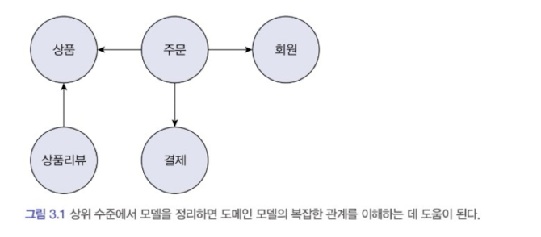
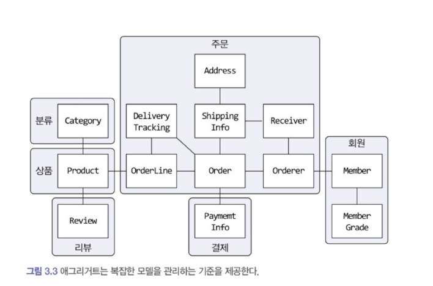
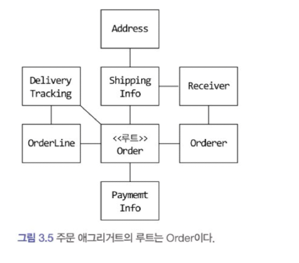

# 도메인 주도 개발 시작하기 챕터3 애그리거트

## 애그리거트

예를 들어 온라인 쇼핑몰 시스템을 개발할 때 아래와 같이 상위 수준 개념을 이용해서 전체 모듈을 정리한다면 전반적인 관계를 이해하는 데 도움이 된다.



만약 이를 각각의 객체 단위로 보게 된다면 개별 구성요소 위주로 모델을 이해하게 되고 전반적인 구조나 큰 수준에서 도메인 간의 관계를 파악하기 어려워진다.

복잡한 도메인을 이해하고 관리하기 쉬운 단위로 만들려면 상위 수준에서 모델을 조망할 수 있는 방법이 필요하고, 이것이 바로 애그리거트이다.



이는 각각의 객체를 애그리거트 단위로 묵어서 표현한 것으로, 모델간의 관계를 개별 모델 수준과 상위 수준에서 모두 이해할 수 있다.

애그리거트는 모델을 이해하는데 도움을 줄 뿐만이 아니라 일관성을 관리하는 기준이 되기도 하는데, 한 애그리거트는 다른 애그리거트에 속하지 않는다.

애그리거트는 독립된 객체 군이며 각 애그리거트는 자신만 관리하고 다른 애그리거트는 관리하지 않는다.

이러한 애그리거트는 관련된 모델을 하나로 모았기 때문에 한 애그리거트에 속한 객체는 유사하거나 동일한 라이프 사이클을 가진다. 주문 애그리거트를 만들려면, Order, OrderLine, Orderer와 같은 관련 객체를 함께 생성해야 한다.

## 애그리거트 루트

만약 구매할 상품의 개수를 변경하면 한 OrderLined의 quantity를 변경하고 더불어 Order의 totalAmounts도 변경해야 한다. 그렇지 않으면 데이터 일관성이 깨진다.

따라서 애그리거트가 속한 모든 객체과 일관된 상태를 유지하려면 애그리거트 전체를 관리할 주체가 필요한데, 이 책임을 지는 것이 바로 애그리거트의 루트 엔티티이다. 애그리거트 루트 엔티티는 애그리거트의 대표 엔티티로 애그리거트에 속한 객체는 애그리거트 루트 엔티티에 직접 또는 간접적으로 속하게 된다.



### 도메인 규칙과 일관성

애그리거트 루트는 애그리거트가 제공해야 할 기능을 구현하는데, 예를 들면 주문 애그리거트는 배송지 변경, 상품 변경과 같은 기능을 제공하고, 애그리거트 루트인 Order가 이 기능을 구현한 메소드를 제공한다.

애그리거트 외부에서 애그리거트에 속한 객체를 직접 변경하면 안되고 무조건 루트를 거쳐야 한다.

이를 위해서 두가지 규칙을 지키도록 하자.

1. 단순히 필드를 변경하는 set 메소드를 public으로 만들지 않는다.
2. 밸류 타입은 불변으로 구현한다.

만약, 모델링 규칙에 의해 애그리거트 루트가 외부의 클래스에 상태 변경을 위임하는 방식을 사용하게 된다면 변경 기능을 외부에서 수행할 수 없도록 이를 패키지나 protected 범위로 한정해서 외부에서 실행할 수 없도록 제한하는 방법 또한 가능하다.

### 트랜잭션 범위

트랜잭션 범위는 작을수록 좋다. 한 트랜잭션이 한개 테이블을 수정하는 것과 세개의 테이블을 수정하는 것을 비교하면 성능에서 차이가 발생한다.

동일하게 한 트랜잭션에서는 한 개의 애그리거트만 수정해야 한다. 한 트랜잭션에서 두 개 이상의 애그리거트를 수정하면 트랜잭션 충돌이 발생할 가능성이 더 높아진다.

이는 한 애그리거트가 다른 애그리거트를 변경하지 않는 다는 것을 의미하는 말이기도 하다.

물론, 팀 표준이나 기술 제약과 같은 내용에서 이를 벗어날 수는 있다.

## 레포지터리와 애그리거트

애그리거트는 개념상 완전한 한 개의 도메인 모델을 표현하므로 객체의 영속성을 처리하는 레포지터리는 애그리거트 단위로 존재한다.

Order와 OrderLine을 물리적으로 각각의 테이블에 저장한다고 하지만, 각각을 위한 레포지터리를 만들지는 않는다.

새로운 애그리거트를 만들면 저장소에 애그리거트를 영속화하고 애그리거트를 사용하려면 저장소에서 애그리거트를 읽어야 하므로, 레포지토리는 보통 다음의 두 메소드를 기본으로 제공한다.

- save : 애그리거트 저장
- findById : ID로 애그리거트를 구함

Order 애그리거트와 관련된 테이블이 세개라면 Order 애그리거트를 저장할 때 애그리거트 루트와 매핑되는 테이블뿐만 아니라 애그리거트에 속한 모든 구성요소에 매핑된 테이블에 데이터를 저장해야 한다.

이와 동일하게 애그리거트를 구하는 레포지터리 메소드는 완전한 애그리거트를 제공해야 한다.

물론, ORM중 하나인 JPA를 사용하는 것과 같이 데이터베이스 관계형 모델에 객체 도메인 모델을 맞춰야 하는 경우도 있다.

이후에 4장에서 RDBMS와 JPA를 이용해서 레포지터리를 구현하는 방법을 살펴볼 것이다.

## ID를 이용한 애그리거트 참조

한 객체가 다른 객체를 참조하는 것처럼 애그리거트도 다른 애그리거트를 참조한다.

애그리거트 간의 참조는 필드를 통해 쉽게 구현할 수 있다. 예를 들어 주문 애그리거트에 속해 있는 Orderer는 주문한 회원을 참조하기 위해 회원 애그리거트 루트인 Member를 필드로 참조할 수 있다.

JPA는 어노테이션을 통해 연관된 객체를 로딩하는 기능을 제공하고 있으므로 필드를 이용해 다른 애그리거트를 쉽게 참조할 수 있다.

하지만 필드를 이용한 애그리거트 참조는 다음과 같은 문제를 야기할 수 있다.

- 편한 탐색 오용
    - 한 애그리거트 내부에서 다른 애그리거트 객체에 접근할 수 있으면 다른 애그리거트의 상태를 쉽게 변경할 수 있다.
    만약 다른 애그리거트의 상태를 변경하게 된다면 애그리거트 간의 의존 결합도를 높여서 결과적으로 애그리거트의 변경을 어렵게 만든다.
- 성능에 대한 고민
    - JPA와 같은 경우 LAZY 전략을 사용할지 EAGER 전략을 사용할지 상황에 따라 고민을 해야하기도 하다.
- 확장 어려움
    - 만약 각각의 애그리거트가 다른 DB를 사용하게 된다면, 위와 같은 방식으로는 작업할 수 없을 것이다.

이러한 세가지 문제를 완화할 때 사용할 수 있는 것이 ID를 이용해서 다른 애그리거트를 참조하는 것으로 DB 테이블에서 외래키로 참조하는 것과 비슷하게 ID를 이용한 참조는 다른 애그리거트를 참조할 때 ID를 사용한다.

ID 참조를 사용하면 모든 객체가 참조로 연결되지 않고 한 애그리거트에 속한 객체들만 참조로 연결된다.

이는 애그리거트의 경계를 명확히 하고 애그리거트 간 물리적인 연결을 제거하기 때문에 모델의 복잡도를 낮춰주고, 응집도를 높이게 된다.

또한 각각의 애그리거트에 대해 ID로 조회하기 때문에 다른 DB를 사용하더라도 문제가 없다.

### ID를 이용한 참조와 조회 성능

다른 애그리거트를 ID로 참조하면 여러 애그리거트를 읽을 때 조회 속도가 문제 될 수 있다.

한 DBMS에 있다면 Join을 통해 읽어올 수 있음에도 불구하고 주문마다 상품 정보를 읽어오는 쿼리를 실행해야 한다.

이는 마치 지연로딩의 N+1 문제와 같은 문제를 야기한다.

N+1을 해결하기 위해서는 조인을 사용해야 하는데, 이는 객체 참조 방식으로 변경하라는 것과 같다.

위와 같은 방식 말고 ID 참조 방식을 사용하면서 N+1 조회와 같은 문제가 발생하지 않도록 하려면 조회 전용 쿼리를 이용하면 된다.

예를 들어 데이터 조회를 위한 별도 DAO를 만들고 DAO의 조회 메소드에서 조인을 이용해 한번의 쿼리로 필요한 데이터를 로딩하면 된다.

```java
public List<OrderView> selectByOrder(String orderId) {
	String selectQuery =
		"select new com.myshop.order.application.dto.OrderView(o, m, p)" +
		"from Order o join o.orderLines ol, Member m, Product p" +
		"where o.orderer.memberId.id = :ordererId" +
		"and o.orderer.memberId = m.id" +
		"and index(ol) = 0" +
		"and ol.productId = p.id";
	TypeQuery<OrderView> query = 
		em.createQuery(selectQuery, OrderView.class);
		query.setParameter("ordererId", orderId);
	return query.getResultList();
}
```

하지만 이 또한 애그리거트마다 다른 DB를 사용한다면 불가능 할 것이다.

이때는 조회 성능을 높이기 위해 캐시를 적용하거나 조회 전용 저장소를 따로 구성해야 한다. 이 방식은 코드가 복잡해지는 단점이 있지만 시스템 처리량을 높일 수 있다는 장점이 있다.

특히 한 대의 DB 장비로 대응할 수 없는 수준의 트래픽이 발생하는 경우 캐시나 조회 전용 저장소는 필히 선택해야 한다.

## 애그리거트 간 집합 연관

이번에는 애그리거트 간 1-N 혹은 M-N 연관에 대해 살펴보자.

두 연관은 컬렉션을 이용한 연관으로, 카테고리와 상품 간의 연관이 대표적이다.

카테고리입장에서 상품은 1-N 관계이고, 상품입장에서 카테고리는 N-1 관계이다.

애그리거트의 1-N 관계는 Set과 같은 컬렉션을 이용해서 표현할 수 있다.

하지만 이러한 방식은 N의 개수가 많아질수록 성능 이슈를 발생시킬 수 있기 때문에, 실제 구현에 반영하지 않는 경우가 많다.

반대로 N-1 관계는 단순히 쿼리를 통해 한번에 구할 수 있다.

M-N 관계의 경우 양쪽 애그리거트에 컬렉션으로 연관을 만드는데, 이때도 마찬가지로 1-N 연관처럼 M-N 연관도 실제 요구사항을 고려하여 구현에 포함시킬지 고려해야 한다.

이 또한 단방향 M-N 관계로 처리할 수 있다.

## 애그리거트를 팩토리로 사용하기

만약 고객이 특정 상점을 여러 차례 신고해서 해당 상점이 더이상 물건을 등록하지 못한다는 가정을 해보자.

이때 상품 등록을 구현한 응용 서비스는 다음과 같이 상점 계정이 차단 상태에서 상품을 생성할 수 없도록 구현할 수 있을 것이다.

```java
public ProductId registerNewProduct(new ProductRequest req) {
	Store store = storeRepository.findById(req.getStoreId());
	checkNull(store);
	if (store.isBlocked() {
		throw new StoreBLockedException();
	}
	ProductId id = productRepsitory.nextId();
	Product product= new Product(...);
	productRepository.save(product);
	return id
}
```

위의 메소드는 Product를 생성 가능한지 판단하는 코드와 Product를 생성하는 코드가 분리되어 있다.

코드가 나빠 보이지는 않지만, 도메인 로직 처리가 응용 서비스에 노출되어 있다.

Store가 Product를 생성할 수 있는지 판단하고 Prodcut를 생성하는 것은 논리적으로 하나의 도메인 기능인데, 이 도메인 기능을 응용 서비스에 구현하고 있는 것이다.

이를 위해 별도의 도메인 서비스나 팩토리 클래스를 만들 수 있지만, 이 기능을 Store 애그리거트에 구현하는 것 또한 가능하다.

```java
public class Store {
	...
	public Product createProduct(ProdctId newProductId, ...) {
		if (isBlocked()) throw new StoreBlockedException();
		return new Product(...);
	}
}
```

Store 애그리거트의 createProduct()는 Product 애그리거트를 생성하는 팩토리 역할을 한다.

이는 팩토리 역할을 하면서도 중요한 도메인 로직을 구현하고 있다.

따라서 이제 응용 서비스는 팩토리 기능을 이용해서 Product를 생성하면 된다.

```java
public ProductId registerNewProduct(new ProductRequest req) {
	Store store = storeRepository.findById(req.getStoreId());
	checkNull(store);
	ProductId id = productRepsitory.nextId();
	Product product= store.createProduct(...);
	productRepository.save(product);
	return id
}
```

앞선 코드와 차이점이라면 응용 서비스에서 더 이상 Store의 상태를 확인하지 않는다는 것이다.

Store의 Product 생산 가능 여부는 Store에서 구현하고 있다.

따라서 Product 생성 가능 여부를 확인하는 도메인 로직을 변경하게 되면 이제 Store만 변경하면 되고 응용 서비스는 변경에 영향을 받지 않기 때문에 도메인의 응집도는 높아졌다.

이것이 바로 애그리거트를 팩토리로 사용할 때 얻을 수 있는 장점이다.