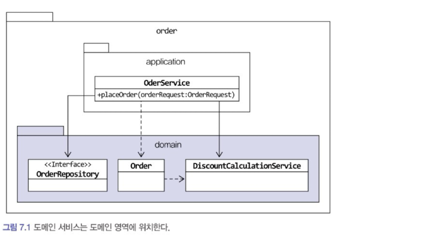

## 여러 애그리거트가 필요한 기능

도메인 영역의 코드를 작성하다 보면, 한 애그리거트로 기능을 구현할 수 없는 경우가 있다.

예를 들어 아래와 같은 경우가 있을 수 있다.

- 상품 애그리거트 : 구매하는 상품의 가격이 필요하다. 또한 상품에 따라 배송비가 추가되기도 한다.
- 주문 애그리거트 : 상품별로 구매 개수가 필요하다.
- 할인 쿠폰 애그리거트 : 쿠폰별로 지정한 할인 금액이나 비율에 따라 주문 총 금액을 할인한다. 할인 쿠폰을 조건에 따라 중복사용할 수 있거나 지정한 카테고리의 상품에만 적용할 수 있다는 제약 조건이 있다면 할인 계산이 복잡해진다.
- 회원 애그리거트 : 회원 등급에 따라 추가 할인이 가능하다.

### **이러한 경우 실제 결제 금액을 계싼해야 하는 주체는 어떤 애그리거트인가?**

어떤 한 애그리거트에 넣기 애매한 도메인 기능을 억지로 넣어 특정 애그리거트에 구현하게 된다면, 자신의 책임 범위를 넘어서는 기능을 구현하기 때문에 코드가 길어지고, 수정을 어렵게 만들 수 있다.

**이런 문제를 해소하는 가장 쉬운 방법은 도메인 기능을 별도 서비스로 구현하는 것이다.**

## 도메인 서비스

도메인 서비스란, 도메인 영역에 위치한 도메인 로직을 표현할 때 주로 사용하는 것으로 다음과 같은 상황에 주로 사용한다.

- 계산 로직
- 외부 시스템 연동이 필요한 도메인 로직

### 계산 로직과 도메인 서비스

애그리거트에 억지로 기능을 넣는 것 보다는 도메인 서비스를 이용하여 도메인 개념을 명시적으로 드러내면 된다.

응용 영역의 서비스가 응용 로직을 다룬다면, 도메인 서비스는 도메인 로직만 다룬다.

```java
public class DiscountCaclulationService }
	public Money calculateDiscountAmounts(
		List<OrderLine> orderLines,
		List<Coupon> coupons,
		MemberGrade grade) {
			... //계산로직
	}
}
```

이러한 할인 계산 서비스를 사용하는 주체는 애그리거트가 될 수도 있고 응용 서비스가 될 수도 있다.

만약 아래와 같이 서비스를 애그리거트의 결제 금액 계산 기능에 전달하게 되면 사용 주체는 애그리거트가 된다.

```java
public class Order {
	public void calculateAmounts(
			DiscountCalculate disCalSvc, MemberGrade grade) {
		Money totalAmounts = getTotalAmounts();
		Money discountAmounts = 
			disCalSvc.calculateDiscountAMounts(this.orderLines, this.coupons, grade);
		this.paymentAmounts = totalAmounts.minus(discountAmounts);
	}
	...
```

이렇게 애그리거트 객체에 도메인 서비스를 전달하여 사용할 수 있으며, 이렇게 전달하는 것은 응용 서비스의 책임이다.

때로는 애그리거트 메소드를 실행할 때 도메인 서비스를 인자로 전달하지 않고 반대로 도메인 서비스의 기능을 실행할 때 애그리거트를 전달하기도 한다.

예를 들어 계좌 이체 기능을 생각하면, 하나는 마이너스고 하나는 플러스가 되어야 한다.

```java
public class TransferService {
	public void transfer(Account fromAcc, Account toAcc, Money amounts) {
		fromAcc.withdraw(amounts);
		toAcc.credit(amounts);
	}
	...
```

한가지 중요한 점이 있는데, 도메인 서비스는 도메인 로직을 수행하지 응용 로직을 수행하지는 않는다.

따라서 트랜잭션 처리와 같은 로직은 응용 로직이기에 도메인 서비스가 아닌 응용 서비스에서 처리해야 한다.

### 외부 시스템 연동과 도메인 서비스

외부 시스템이나 타 도메인과 연동 기능도 도메인 서비스가 될 수 있다.

시스템 간 연동은 HTTP API 호출로 이루어질 수 있지만, 도메인 입장에서는 특정 도메인 로직으로 볼 수 있다.

단지 이때 중요한 것은 도메인 로직 관점에서 인터페이스로 작성해야 한다는 것이다.

```java
public interface SurveyPermissionChecker {
	boolean hasPermission(String userId);
}
```

이제 응용 서비스는 이 도메인 서비스를 이용해서 로직을 수행할 수 있다.

```java
public class CreateSurveyService {
	private SurveyPermissionChecker premissionChecker;
	
	public Long createSurvey(CreateSurveyRequest req) {
		validate(req);
		// 도메인 서비스를 이용해서 외부 시스템 연동을 표현
		if (!permissionChecker.hasPermission(req.getRequestorId())) {
			throw new NoPermissionException();
		}
		...
	}
}
```

이때 SurveyPermissionChecker 인터페이스를 구현한 클래스는 인프라스터럭처 영역에 위치해 연동을 포함한 로직을 구현한다.

### 도메인 서비스의 패키지 위치

도메인 서비스는 도메인 로직을 표현하므로 도메인 서비스의 위치는 다른 도메인 구성요소와 동일한 패키지에 위치한다.



### 도메인 서비스의 인터페이스와 클래스

도메인 서비스의 로직이 고정되어 있지 않은 경우 도메인 서비스 자체를 인터페이스로 구현하고, 이를 구현한 클래스를 둘 수도 있다.

위와 같이 외부 시스템이나 별도 엔진을 이용해서 구현하는 경우가 대표적이다.

이때는 도메인 영역에는 도메인 서비스 인터페이스가 위치하고, 실제 구현은 인프라스트럭처 영역에 위치한다.

