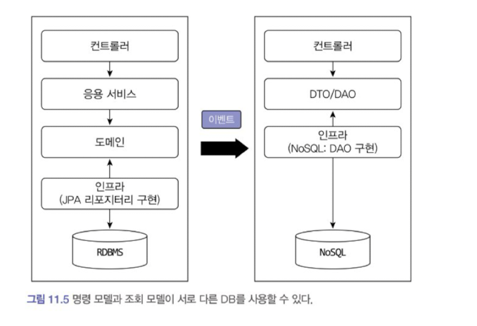

## 단일 모델의 단점

예를 들어 쇼핑몰에서 주문 내역 조회 기능을 구현하면 여러 애그리거트에서 데이터를 가져와야 한다.

Order에서 주문 정보, Product에서 상품 정보, Member에서 회원 정보를 가져와야 한다.

조회 화면은 조회 속도가 빠를수록 좋은데 여러 애그리거트의 데이터가 필요하면, 구현 방법을 고민해야 한다.

이를 위해서 여러가지 방법을 시도해도 계속해서 고려할 부분이 많을 것이다.

이런 고민이 생기는 이유는 시스템 상태를 변경할 때와 조회할 때 단일 도메인 모델을 사용하기 때문이다.

도메인 모델을 구현할 때 사용하는 ORM 기법은 도메인 상태 변경 기능을 구현하는데는 적합하지만, 여러 애그리거트에서 데이터를 동시에 가져올 때는 구현을 복잡하게 만드는 원인이 된다.

이때 상태 변경을 위한 모델과 조회를 위한 모델을 분리하면 좋은 방식이 된다.

## CQRS

시스템이 제공하는 기능은 크게 두가지로 나눌 수 있는데, 하나는 상태를 변경하는 기능이고 하나는 조회하는 기능이다.

CQRS는 Command Query Responsibility Segregation 의 약자로, 상태를 변경하는 명령 모델과 상태를 제공하는 조회 모델을 분리하는 패턴이다.

이러한 CQRS를 사용하면 각 모델에 맞는 구현 기술을 선택할 수 있다.

예를 들어 명령 모델은 객체 지향에 기반해 도메인 모델을 구현하기에 적당한 JPA를 사용하고 조회 모델은 DB 테이블에서 SQL로 데이터를 조회할 때 좋은 MyBatis를 사용할 수 있다.

혹은 명령 모델과 조회 모델은 서로 다른 데이터 저장소를 사용할 수 있다.

명령 모델은 트랜잭션을 지원하는 RDBMS를 사용하고 조회 모델은 조회 성능이 좋은 NoSql을 사용하는 것이다.

다만 이때 두 저장소 간에 동기화를 시켜야 하는데 이를 10장에서 살펴본 이벤트를 사용할 수 있다.

## CQRS 장단점

CQRS 패턴을 적용할 때 얻을 수 있는 장점은 명령 모델을 구현할 때 도메인 자체에 집중할 수 있다는 점이다.

복잡한 도메인은 주로 상태 변경 로직이 복잡한데 명령 모델과 조회 모델을 구분하면 조회 성능을 위한 코드가 명령 모델에 없으므로 도메인 로직을 구현하는데 집중할 수 있다.

반면, 트래픽이 적거나 도메인이 단순한 경우 조회 전용 모델을 따로 만들 때 얻을 수 있는 이점에 대해 따져보아야 한다.

더 많은 기술이 필요하고, 복잡성이 늘어나기 때문에 여러가지를 고려하여 도입하면 좋다.